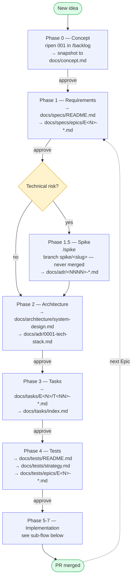
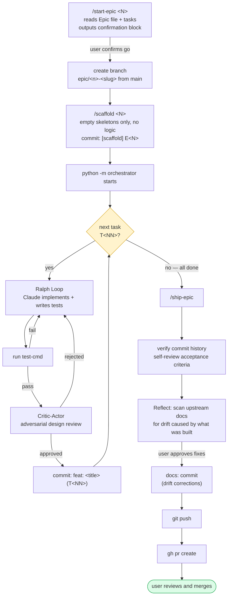

# Workflow Overview

A visual map of the phased, spec-driven workflow this template implements.
The phase rules themselves live in `~/.claude/skills/workflow-*/SKILL.md`
(global, apply to every project cloned from this template) — this file is
a quick-recall reference, not a source of truth. If it drifts from the
skills, the skills win.

## Main Flow

Every arrow labeled `approve` is a hard stop: the phase ends with an
explicit approval request, and nothing in the next phase starts before
the user confirms. The Spike is the only optional phase — most Epics skip
it and go straight from Requirements to Architecture.

## Implementation Sub-Flow (per Epic)

Claude never runs `git checkout -b`, never commits during the loops
(the orchestrator owns the per-task commit), and never merges or pushes
to `main` directly — the user always merges.

## Phase Reference

| Phase | Skill | Command(s) | Primary output |
|---|---|---|---|
| 0 — Concept | `workflow-backlog` (ripening) + `workflow-concept` (artifact) | `/backlog 001` → snapshot promotion | `docs/concept.md` |
| 1 — Requirements | `workflow-requirements` | always via `/backlog` promotion (1..N REQs per item) — at Phase 1 kick-off just in rapid succession | `docs/specs/README.md`, `docs/specs/epics/E<N>-*.md` |
| 1.5 — Spike (optional) | `workflow-spike` | `/spike <question>` | `docs/adr/<NNNN>-*.md`, branch `spike/<slug>` |
| 2 — Architecture | `workflow-architecture` | — | `docs/architecture/system-design.md`, `docs/adr/0001-tech-stack.md` |
| 3 — Tasks | `workflow-tasks` | — | `docs/tasks/E<N>/T<NN>-*.md`, `docs/tasks/index.md` |
| 4 — Tests | `workflow-tests` | — | `docs/tests/README.md`, `docs/tests/strategy.md`, `docs/tests/epics/E<N>-*.md` |
| 5-7 — Implementation | `workflow-implementation` | `/start-epic`, `/scaffold`, `python -m orchestrator`, `/ship-epic` | code + tests, one PR per Epic |
| cross-cutting | `workflow-epics` | — | Epic naming/sizing conventions used by every phase above |
| reactive (post-done) | `workflow-bugs` | — | `docs/tasks/E<N>/B<NN>-*.md`, entries in `docs/tasks/index.md` (Type: bug) |

Skills live at `~/.claude/skills/workflow-*/SKILL.md` and are global —
they apply to every project cloned from this template, not just this repo.

## Easy-to-Forget Concepts

- **Three levels of acceptance criteria, not one:**
  `REQ-AC` (Phase 1, behavioral) → `Epic-AC` (Phase 3, user-observable) →
  `Task-AC` (Phase 3, technical). Later levels refine earlier ones; they
  must never contradict them.
- **Requirements are append-only.** A substantial change to an approved
  requirement is a *supersession* (`STATUS: superseded by <new-ID>`), not
  an edit in place. IDs are never reused or renumbered.
- **Epic sizing:** 3–8 tasks, demoable in 30 seconds after merge. Smaller
  is noise, larger is unreviewable. A pure refactor with no user-visible
  delta is not an Epic.
- **Template-file marker:** files awaiting real content carry
  `status: template` frontmatter + an inline banner. Remove both when
  filling them for real — a file without these markers is real content,
  never edit it as if it were still a placeholder.
- **Foundational contradictions mid-Epic** (architecture can't work,
  a requirement turns out impossible) stop everything immediately and
  propagate upstream with user go-ahead — this is different from the
  routine drift the Reflect step handles at `/ship-epic` time.

## Golden Rules

**Never:**
- Skip phases
- Implement without an approved task or bug
- Change architecture without approval
- Add unrelated features
- Modify unrelated files

**Always:**
- Stay within task scope
- Ask when uncertain
- Prefer simplicity over complexity
- Follow acceptance criteria strictly
