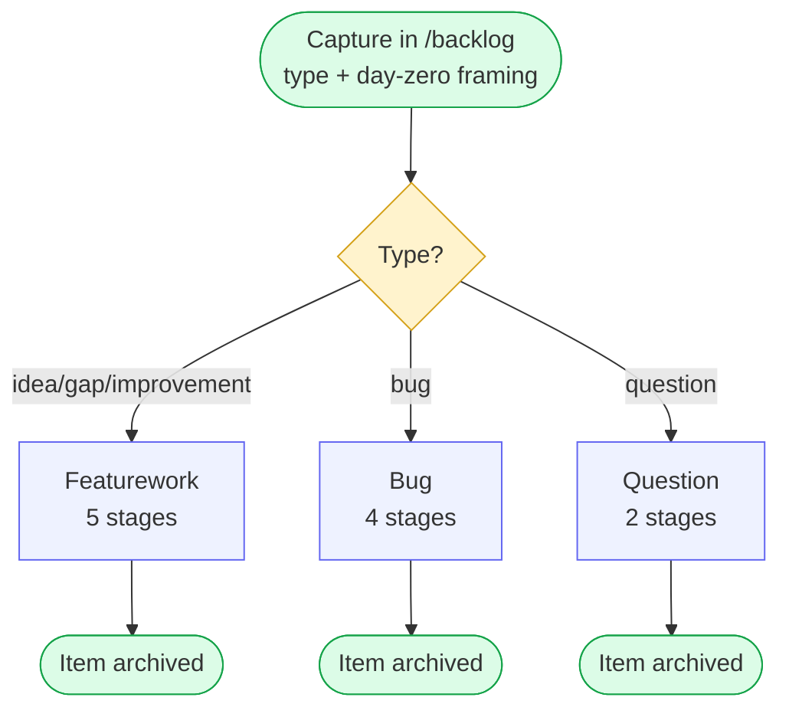
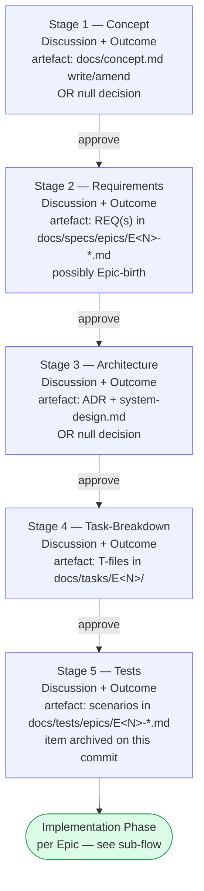
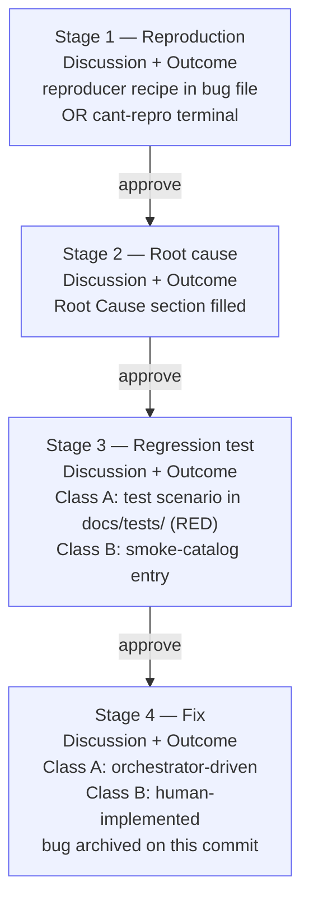
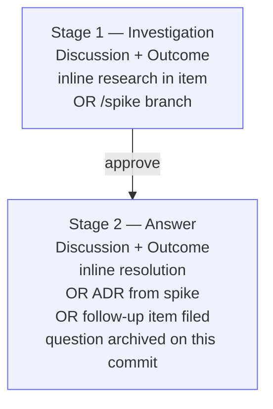

# Workflow Overview

A visual map of the backlog-item-driven, stage-based workflow this template implements.
The stage rules themselves live in `~/.claude/skills/workflow-*/SKILL.md`
(global, apply to every project cloned from this template) — this file is
a quick-recall reference, not a source of truth. If it drifts from the
skills, the skills win.

## Central principle

**Everything starts as a backlog item.** The item's `type` determines its
**lifecycle**, and the lifecycle defines the **stages** the item runs through.
Each stage is deliberately entered with its own approval gate and its own
commit — never grouped, never auto-skipped. Every artefact produced carries
a Source pointer back to the item; the item's Stage sections accumulate
pointers to every artefact it produced.

## The three lifecycles

## Featurework lifecycle (idea / gap / improvement)

Skill: `workflow-lifecycle-featurework`. Five stages, ordered, each deliberately entered.

Every arrow is a hard stop: the stage ends with an explicit approval request,
and nothing in the next stage starts before the user confirms. Stages 1 and 3
can legitimately produce a **null decision** (no artefact) if the item's
ripening didn't require it — the null is recorded in the item's Outcome
sub-section, never silently skipped.

Item 001 (project seed) runs this lifecycle. Its Stage 1 always produces the
initial `docs/concept.md` (concept file doesn't exist yet, so cannot be null).

## Bug lifecycle

Skill: `workflow-lifecycle-bug`. Four stages, reactive-only (humans file bugs,
orchestrator never does).

Test-first regression discipline: Stage 3 (regression test, RED) always
comes before Stage 4 (fix, flips to GREEN). Class B bugs skip the
orchestrator in Stage 4 and are manually implemented.

## Question lifecycle

Skill: `workflow-lifecycle-question`. Two stages, short flow.

If Stage 1 chose the spike route, its outcome is the spike branch + closing
ADR (per `workflow-spike`). Stage 2 references that ADR as the answer.

## Implementation Sub-Flow (per Epic — for featurework items after Stage 5)

Claude never runs `git checkout -b`, never commits during the loops
(the orchestrator owns the per-task commit), and never merges or pushes
to `main` directly — the user always merges.

Bugs (Class A) enter the same orchestrator loop at Stage 4 of the bug
lifecycle, but pick up as `fix:` commits instead of `feat:` and are
constrained by the pinned regression test from Stage 3.

## Skill map

| Skill | Role |
|---|---|
| `workflow-backlog` | Universal capture and cross-cutting item conventions (types, universal frontmatter, item structure, design-conversation principles, cross-item references) |
| `workflow-lifecycle-featurework` | 5-stage lifecycle for idea / gap / improvement |
| `workflow-lifecycle-bug` | 4-stage lifecycle for bug |
| `workflow-lifecycle-question` | 2-stage lifecycle for question |
| `workflow-concept` | Artefact spec for `docs/concept.md` (used at Stage 1 of featurework) |
| `workflow-requirements` | Artefact spec for REQ entries + Epic files (used at Stage 2 of featurework) |
| `workflow-architecture` | Artefact spec for ADR + `docs/architecture/system-design.md` (used at Stage 3 of featurework, sometimes at Stage 1 of question via spike) |
| `workflow-tasks` | Artefact spec for task files (used at Stage 4 of featurework and Stage 4 of bug) |
| `workflow-tests` | Artefact spec for test-scenario files (used at Stage 5 of featurework and Stage 3 of bug) |
| `workflow-spike` | Artefact spec for spike branches + closing ADRs (used at Stage 1 of question when investigation route is spike) |
| `workflow-epics` | Epic naming/sizing conventions used across all featurework lifecycles |
| `workflow-implementation` | Orchestrator + Git workflow for turning task/bug files into merged code |
| `workflow-new-project` | Scaffold flow for creating a fresh downstream project from project-template |

Skills live at `~/.claude/skills/workflow-*/SKILL.md` and are global —
they apply to every project cloned from this template.

## Easy-to-Forget Concepts

- **Type is immutable.** Once an item is filed with a type, that type
  determines the lifecycle for its life. If a type turns out wrong
  (bug misdiagnosed as improvement, question that's really a feature),
  drop the item and refile with the correct type. Cross-link both.
- **Clarification markers are the anti-hallucination valve.** Whenever
  a stage's discussion would have to invent an intent-shaped answer,
  Claude MUST inline a `[NEEDS CLARIFICATION: ...]` marker instead
  of writing a plausible default. Markers have three states — open,
  inherited (`→ Stage N`), resolved (`RESOLVED → Stage N: ...`) — and
  every stage-approval commit lists open markers explicitly. See
  `workflow-backlog` for syntax and the approval/entry checks.
- **Backward reach has three cases (A / B / C).** A is inline
  clarification in the current stage (no prior-stage artefact touched).
  B is a supersession-in-place on a prior-stage artefact (item stays
  in current stage). C is a walk-back — item's `stage` frontmatter
  moves back, a new attempt begins, previous-attempt Discussion/Outcome
  stay in the file. Decision tree, ceremony, and guards live in
  `workflow-lifecycle-featurework` (bugs/questions rarely need C —
  they use A or drop-and-refile).
- **Frontmatter tracks stage.** Every backlog item carries `stage: <N>`
  and `stage_attempt: <K>` in its frontmatter, kept in sync with the
  body's `**Approved:**` lines. This makes "what is in stage N right
  now?" a grep instead of a scan through 30 files.
- **Three levels of acceptance criteria, not one:**
  `REQ-AC` (Stage 2 of featurework, behavioral) → `Epic-AC` (Stage 4,
  user-observable) → `Task-AC` (Stage 4, technical). Later levels refine
  earlier ones; they must never contradict them.
- **Requirements are append-only.** A substantial change to an approved
  requirement is a *supersession* (`STATUS: superseded by <new-ID>`), not
  an edit in place. IDs are never reused or renumbered.
- **Every artefact carries a Source.** REQ has `Source: [[NNN-slug]]`,
  ADR has `Source-item:` + `Source-REQs:`, Task has `Source:` header +
  `## Requirements` section, Test scenario has `Source` column per row,
  concept has `## Change log` bullets. No orphan artefacts.
- **Foundational contradictions mid-Epic** (architecture can't work,
  a requirement turns out impossible) stop everything immediately and
  propagate upstream with user go-ahead.
- **Template-file marker:** files awaiting real content carry
  `status: template` frontmatter + an inline banner. Remove both when
  filling them for real.

## Golden Rules

**Never:**
- Skip stages (each stage is deliberately entered, even for null outcomes)
- Group multiple stages into one commit (each stage is its own approval gate)
- File a task without a REQ (no direct-task-bypass)
- Modify unrelated files during a stage's work
- Implement without an approved task or bug

**Always:**
- Confirm the type at capture (lifecycle depends on it)
- Stay within the current stage's scope
- Record a null decision when a stage has no artefact (never silently skip)
- Ask when uncertain
- Prefer simplicity over complexity
- Follow acceptance criteria strictly
